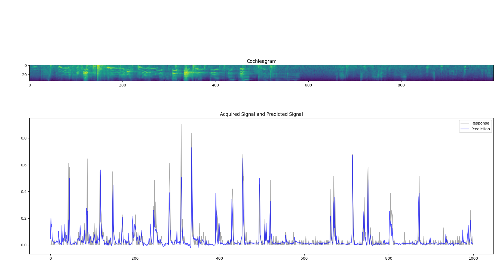

# deepSTRF
*A PyTorch library for fitting sensory neural responses with deep neural network models*

[](https://deepstrf.readthedocs.io/en/latest/)
[](https://github.com/urancon/deepSTRF/actions/workflows/ci.yml)
[](LICENSE)


**Contact:** Ulysse Rançon — [@urancon](https://github.com/urancon/), ulysse.rancon@uni-goettingen.de

----

## 🧠 Overview

deepSTRF is a community-oriented library for **system identification of sensory neurons** — predicting trial-resolved neural responses (spikes, calcium fluorescence, EEG, intracellular potential, ...) from naturalistic stimuli with PyTorch models. It bundles:

- **Datasets.** A growing zoo of publicly available recordings (auditory cortex, midbrain, songbird auditory pallium, EEG, ...) behind a single `NeuralDataset` API with consistent NaN-sentinel handling for missing trials, optional `download=True` auto-download, and built-in selection / concatenation utilities.
- **Models.** A unified four-slot template (`wav2spec → prefiltering → core → readout`) with reference implementations of widely used encoders (Linear, 2D-CNN, StateNet, DNet, Transformer, NRF) and the **AdapTrans** module of ON/OFF auditory adaptation.
- **Pretrained checkpoints** published on the [Hugging Face Hub](https://huggingface.co/urancon).
- **Metrics.** NaN-aware Pearson, FVE, Schoppe-normalized correlation, signal/noise power, coherence — all functional and `torch.compile`-friendly.
- **Training utility.** A thin opt-in `Fitter` (~150 lines) for early-stopping + best-checkpoint training, on top of the canonical PyTorch loop.

📖 **Full documentation: [deepstrf.readthedocs.io](https://deepstrf.readthedocs.io/)**



----

## ⚡ Installation

deepSTRF requires **Python ≥ 3.10**. It is not yet on PyPI; install from source:

```shell
git clone https://github.com/urancon/deepSTRF
cd deepSTRF
pip install -e ".[dev]"      # or `pip install -e .` for runtime only
```

Optional extras: `[docs]`, `[allen]` (Allen Brain Observatory tooling), `[s4]` (CUDA kernels for S4 layers), `[nems]` (LBHB NEMS interop, used by NAT4 preprocessing), `[eeg]` (MNE for `.fif` parsing).

See the [Installation guide](https://deepstrf.readthedocs.io/en/latest/_source/md/README_installation.html) for conda recipes and troubleshooting.

----

## 🚀 Quickstart

Load a published checkpoint, score it on the canonical NS1 ferret-A1 dataset:

```python
from torch.utils.data import DataLoader
from deepSTRF.datasets.audio.ns1_drc import NS1Dataset
from deepSTRF.models.audio import StateNet
from deepSTRF.metrics import corrcoef, normalized_corrcoef
from deepSTRF.utils.data import neural_collate

# 1) Load a dataset (auto-downloads to a local cache the first time).
ds = NS1Dataset(download=True, dt_ms=5)
loader = DataLoader(ds, batch_size=8, collate_fn=neural_collate)

# 2) Load a pretrained model from the Hugging Face Hub.
model = StateNet.from_pretrained("urancon/deepSTRF-statenet-gru-ns1").eval()

# 3) Score it.
stims, responses, _, _ = next(iter(loader))
pred    = model(stims)                                      # (B, N, R=1, T)
psth    = responses.nanmean(dim=2, keepdim=True)
cc      = corrcoef(pred, psth, reduction='mean')
cc_norm = normalized_corrcoef(pred, responses, method='schoppe', reduction='mean')
print(f"CCraw = {cc:.3f}   CCnorm = {cc_norm:.3f}")
```

----

## 🤖 Train a model

The opt-in `Fitter` wraps the canonical training loop (loss + early stop + best-checkpoint selection) in ~10 lines of user code:

```python
from torch.optim import Adam
from deepSTRF.training import Fitter
from deepSTRF.metrics import mse_loss, normalized_corrcoef

fitter = Fitter(
    model=model,
    optimizer=Adam(model.parameters(), lr=1e-3),
    train_loader=train_loader,
    val_loader=val_loader,
    loss_fn=mse_loss,
    val_metrics={
        'cc_norm': lambda pred, resp: normalized_corrcoef(pred, resp, method='schoppe', reduction='mean'),
    },
)
fitter.fit(num_epochs=50)
```

For custom loops (mixed precision, multi-GPU, curricula, ...), the canonical three-line PyTorch loop documented in [`metrics_paradigm.md` §7](https://deepstrf.readthedocs.io/en/latest/_source/md/metrics_paradigm.html) stays a one-liner thanks to the metrics API. See the [Fitter docs](https://deepstrf.readthedocs.io/en/latest/_source/md/fitter.html) for hooks and design rationale.

----

## 📓 Tutorials

Runnable notebooks live under [`examples/`](examples/) — each opens in Colab in one click.

| Notebook | Focus |
|---|---|
| `crcns_aa_tutorial.ipynb` | **Start here.** Load CRCNS AA1 / AA2 zebra finch data end-to-end. |
| `explore_nat4.ipynb` | Inspect NAT4 ferret A1 / PEG recordings. |
| `dataset_concatenation.ipynb` | Mix multiple datasets behind one `DataLoader`. |
| `fit_ns1_statenet.ipynb` | Fit StateNet on NS1 from scratch. |
| `load_pretrained_statenet_ns1.ipynb` | Reuse the published HF Hub checkpoint. |
| `alice_eeg_tutorial.ipynb` | EEG (Brodbeck 2023, "Alice"). |
| `meliza_2025_baseline.ipynb` | Zebra finch responses to occluded conspecific song. |
| `strf_parameterizations_ns1.ipynb` | Parametric Gaussian-mixture STRFs. |
| `strf_gradmap_aa2.ipynb` | Gradient-attribution receptive fields on AA2. |
| `adaptrans_transformer_aa1.ipynb` | AdapTrans + Transformer on AA1 Field L. |
| `espejo_nat_nrf.ipynb` | Network Receptive Field model on Espejo ferret A1. |

----

## 🏁 Benchmark

Current top model on each dataset. Want to claim the podium? Open a PR with a ready-to-deploy PyTorch class so others can reproduce.

|   **Dataset**   | **Model**   | **Remarks** | **Params / nrn** | **CCraw / CCnorm [%]** |                          **Paper**                          |
|:---------------:|:-----------:|:-----------:|:----------------:|:----------------------:|:-----------------------------------------------------------:|
|     **NS1**     | StateNet    | GRU, pop    |      30,465      |       55.6 / 75.1      | [Rançon et al.](https://doi.org/10.1038/s42003-025-08858-3) |
|   **NAT4 A1**   | StateNet    | LSTM, pop   |      40,271      |       46.6 / 65.1      | [Rançon et al.](https://doi.org/10.1038/s42003-025-08858-3) |
|  **NAT4 PEG**   | Transformer | pop         |      28,437      |       39.7 / 55.5      | [Rançon et al.](https://doi.org/10.1038/s42003-025-08858-3) |
| **AA1 Field L** | StateNet    | GRU, pop    |      24,900      |          / 71.0        | [Rançon et al.](https://doi.org/10.1038/s42003-025-08858-3) |
|   **AA1 MLd**   | StateNet    | Mamba, pop  |      32,334      |          / 73.4        | [Rançon et al.](https://doi.org/10.1038/s42003-025-08858-3) |

> **Note.** The three CRCNS AC1 datasets (Wehr, Asari A1, Asari MGB) are single-unit fitting only and yield very different results depending on response preprocessing (detrending, spikes vs. raw potential, ...). Their benchmark will be reported separately.

----

## 📚 Datasets included

deepSTRF wraps publicly available recordings — please cite the original authors when you use them. See each dataset page on the [docs](https://deepstrf.readthedocs.io/) for details and download instructions.

- **Auditory:** [NS1](docs/_source/md/README_NS1.md), [NAT4](docs/_source/md/README_NAT4.md), [CRCNS AA1](docs/_source/md/README_CRCNS_AA1.md), [CRCNS AA2](docs/_source/md/README_CRCNS_AA2.md), [CRCNS AA4](docs/_source/md/README_CRCNS_AA4.md), [CRCNS AC1 (Wehr + Asari)](docs/_source/md/README_CRCNS_AC1.md), [Espejo 2019](docs/_source/md/README_Espejo.md), [Alice EEG (Brodbeck 2023)](docs/_source/md/README_Alice_EEG.md), [Meliza 2025](docs/_source/md/README_Meliza_2025.md), [Wingert 2026](docs/_source/md/README_Wingert2026.md).
- **Visual:** under construction — see [Status](#-status--audio-first) below.

----

## 🚧 Status — audio-first

The first release of deepSTRF focuses on **auditory** datasets and models. A working video API is on the roadmap but is not yet shipped on `develop` — the `deepSTRF.datasets.video` and `deepSTRF.models.video` namespaces currently expose only their base classes (`VideoNeuralDataset`, `VideoEncodingModel`). Earlier draft loaders (Allen Ophys / Ecephys, CRCNS PVC1 / PVC11 / MT1 / MT2 / VIM2, MICrONS, UW Neural Data Challenge) live on the [`archive/video-api-v0`](https://github.com/urancon/deepSTRF/tree/archive/video-api-v0) branch and will be revived once rewritten against the modernized base class.

----

## 💡 Contributing

Pull requests are welcome — most useful drops are new datasets, new model backbones, and pretrained checkpoints. Please open an issue first so we can scope it together (most importantly to confirm the dataset's license allows redistribution).

----

## 📖 Citation

If deepSTRF is useful for your work, please cite the relevant paper:

```bibtex
@article{rancon2024pcb,
    title   = {A general model unifying the adaptive, transient and sustained properties of ON and OFF auditory neural responses},
    author  = {Rançon, Ulysse and Masquelier, Timothée and Cottereau, Benoit R.},
    journal = {PLOS Computational Biology},
    year    = {2024},
    volume  = {20},
    number  = {8},
    pages   = {1--32},
    doi     = {10.1371/journal.pcbi.1012288},
}

@article{rancon2025commbio,
    title   = {Temporal recurrence as a general mechanism to explain neural responses in the auditory system},
    author  = {Rançon, Ulysse and Masquelier, Timothée and Cottereau, Benoit R.},
    journal = {Communications Biology},
    year    = {2025},
    volume  = {8},
    number  = {1},
    pages   = {1456},
    doi     = {10.1038/s42003-025-08858-3},
}
```

A running list of papers that build on deepSTRF lives on the [Publications](https://deepstrf.readthedocs.io/en/latest/_source/md/README_publications.html) docs page. PRs welcome to add yours.
