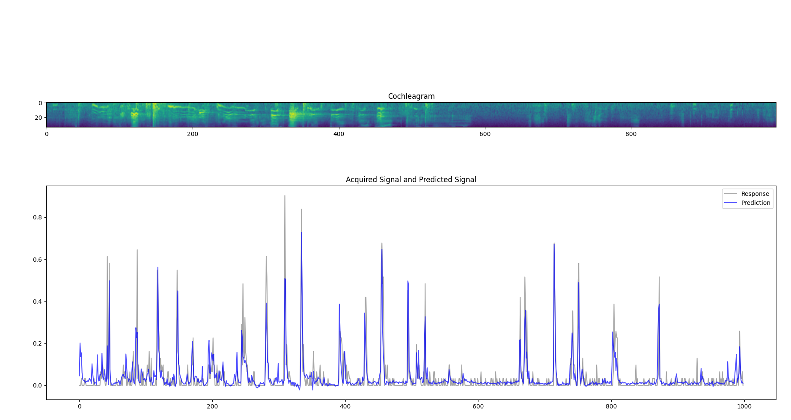

# deepSTRF
*Fitting of auditory neural responses with a GRU-based, biologically-inspired deep neural network model.*
____

## Presentation

TODO



## Installation

This repository assumes you are comfortable with Python environments and conda. To learn more about conda, please visit
https://anaconda.org/.

First create a conda environment and activate it with the following commands:
```shell
conda create --name deepSTRF_env python=3.8
conda activate deepSTRF_env
```

Then, download this repository and get inside:
```shell
git clone https://github.com/urancon/deepSTRF
cd deepSTRF
```

Install Python libraries and dependencies for this code:
```shell
pip3 install -r requirements.txt
```

Download the datasets and move them to the appropriate place:
```shell
Explain how to download and install the datasets ! 
```

Now you should be all set up to reproduce our experiments. Have fun !


## Train a model

TODO: you will need a wandb account. Present wandb.

The script `main.py` allows you to reproduce major experiments presented in our paper. To train our model with default 
settings, just execute the following command:
```shell
python3 main.py
```

You can also do your own experiment by changing the hyperparameters ! For instance:
```shell
python3 main.py -option1 value1 -option2 value 2
```

To know more about possible options, please do:
```shell
python3 main.py --help
```

## References

This work was made possible by the generous publication of several electrophysiology datasets. If you find them useful
for your research or use them, please do not forget to cite their corresponding article:
* NS1 & DRC
* NAT4


## Citation

If you use this repository useful for your research and/or liked our paper, please consider citing it in your work:
```text


```