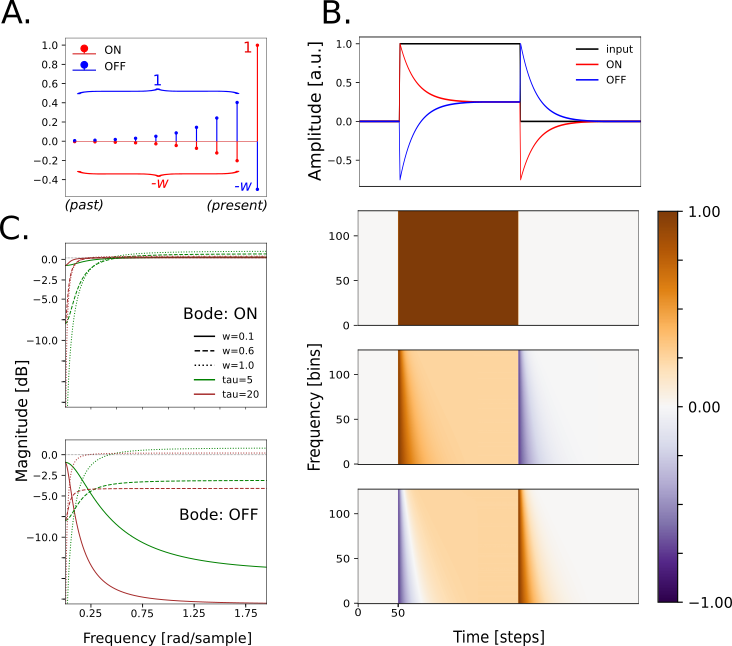

# AdapTrans model of ON/OFF responses and adaptation

***"AdapTrans"*** is a simple computational model that was presented in the paper ["A general theoretical framework unifying the 
adaptive, transient and sustained properties of ON and OFF auditory responses"](https://www.biorxiv.org/content/early/2024/01/20/2024.01.17.576002) by Rançon et al.

## Presentation

It is constituted of a family of parameterized paired linear filters, that effectively compute increment/decrement (ON/OFF) 
features in each spectral band of a given spectrogram. 
In other words, 2 learnable kernels are convolved along the temporal dimension of each frequency.

It takes a single-channel spectrogram as input, and returns a 2-channel (ON/OFF) spectrogram as output.




## Advantages

AdapTrans is an interesting model in itself, in that it fits with several known properties of biological auditory responses.
But it can also be integrated into conventional models, which has mainly 2 benefits:
* increases the response fitting performances 
* increases interpretability by making ON/OFF STRFs retrievable

AdapTrans only adds 3 learnable (and easily interpretable !) parameters per frequency; a negligible amount before that 
of the backbone. Please consult the paper if you are interested to try it in you models.


## Usage

In this repository, we implemented AdapTrans for each computational neural response model, but leave the choice to keep 
it or not (not active by default) to the end user. 
It is implemented as the `AdapTrans(...)`class of `model_zoo/prefiltering.py`.

If you decide to use it in your model, you need to specify some additional hyperparameters to its constructor. Namely, a
Python dict with the following keys (for example):
```python
prefilt_dict = {'type': 'AdapTrans',    # also available: 'willmore' 
                'dt': 1.0,              # ms
                'min_freq': 500,        # min freq of the cochleagram
                'max_freq': 20000,      # max ..
                'scale': 'mel'          # if frequencies are mel-spaced
                }     
```


